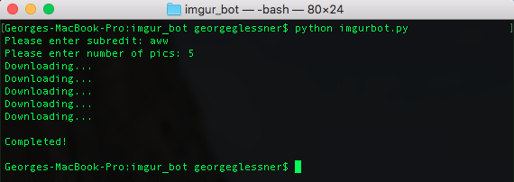
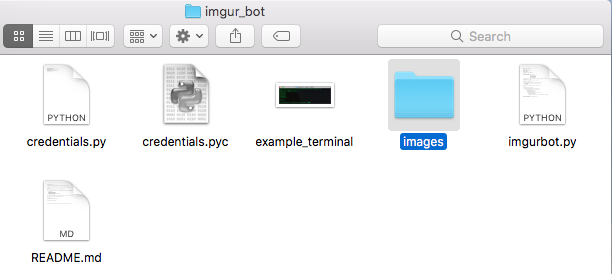
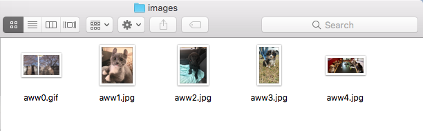

# Reddit Imgur Bot

A reddit bot that downloads Imgur pictures from a given subreddit.

___NOTICE: This application is functional, however I will be adding more features to it.___

## How to use  
First, create a reddit personal use script application.

Next, add a `credentials.py` file to your working directory and add your applications credentials.

    ID='YOUR_ID'  
    SECRET='YOUR_SECRET'  
    PASSWORD='YOUR_PASSWORD'  
    AGENT='Example Bot by /u/example_bot'  
    USERNAME='YOUR_USERNAME'  

Create a folder called "images" in the directory that your `credentials.py` and `imgurbot.py` files are in. This is where your pictures will be saved.

Run the application using `python imgurbot.py` and follow the instructions.

Your images will appear in the "images" folder.

__Helpful note:__ To view .gif files on a Mac select the image(s) and press "cmd" + "y".

## Example Use

_Please e-mail or comment any features that would improve this application._
